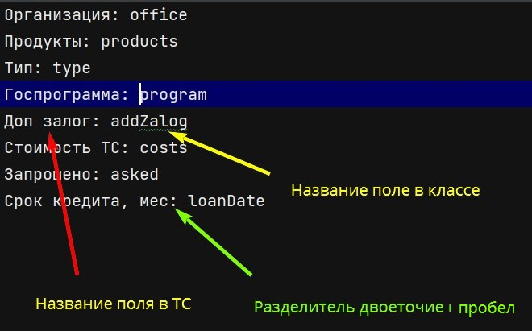

## Приложение для создания XML файла на основании тест кейса (ТС) 
### о приложении
В процессе разработки автотестов, необходимо создавать XML файлы для создания POJO класса
Данное приложение призвано облегчить создание XML файлов на основании ТС, для дальнейшей
работы с ними.
### структура
В корне располагается класс-стартер [TestCaseToXMLMaker](src/application/TestCaseToXMLMaker.java)   
Директория [filestorage](src/main/java/app/filestorage) содержит классы:  
[input.txt](src/main/java/app/filestorage/input.txt) - входящий файл, содержащий ТС или его фрагмент  
[task.txt](ssrc/main/java/app/filestorage/task.txt) - файл, содержащий пары: 'название поля в тест кейсе': 'название поля, в вашем pojo классе'  
[created_data.xml](src/main/java/app/filestorage/created_data.xml) - результат работы приложения
PS При необходимости названия можно изменять, см. код и пояснения внутри классов  
Директория [xmlfactory](src/application/xmlfactory) содержит следующие классы:  
[TestCaseReader](src/main/java/app/xmlfactory/TestCaseReader.java) - класс, отвечающий за чтение тест кейса и
получения из него данных.  
[TaskReader](src/main/java/app/xmlfactory/TaskReader.java) - класс, отвечающий за работу по чтению файла, 
описывающего пары (полеТС: полеPojo).  
[XmlCreator](src/main/java/app/xmlfactory/XmlCreator.java) - класс, создающий XML файл
### предварительная настройка и запуск
1. В директорию [filestorage](src/main/java/app/filestorage) поместите ТС или его фрагмент в текстовый файл input.txt
(см. формат [образца](src/main/java/app/examples))
2. В указанную директорию поместите текстовый файл task.txt, оформленный согласно [образцу](src/application/examples)
 
3. Запустите класс [TestCaseToXmlMaker](src/main/java/app/TestCaseToXMLMaker.java)
4. в директории [filestorage](src/main/java/app/filestorage) будет сформирован XML-файл  

### PS
Ввиду возможных дальнейших обновлений, возможны отклонения от вышеописанных инструкций

